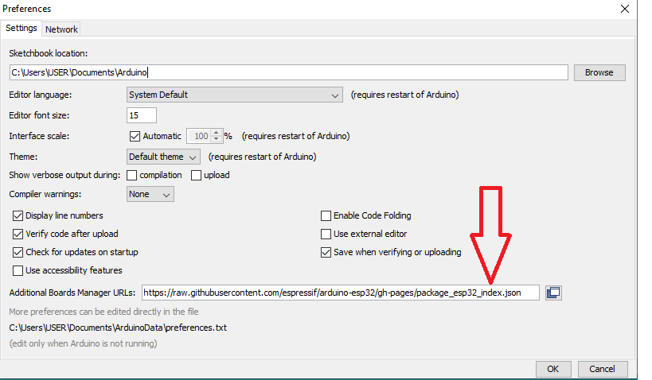
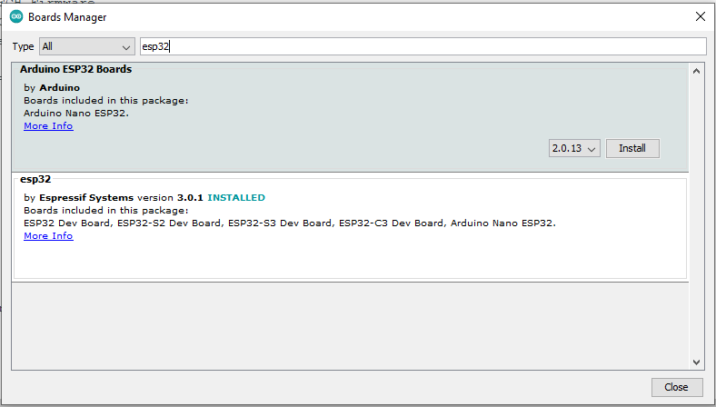

## Hitech Controler Firmware

### Overview

This firmware is designed for an ESP32 module to enable Bluetooth control of devices within a caravan. The firmware establishes a Bluetooth Low Energy (BLE) server that can be connected to by a compatible mobile app. Through the app, users can send commands to control relays connected to devices in the caravan, such as lights or appliances. Additionally, the firmware provides real-time feedback on relay status and sensor data.

### Features

- Bluetooth Connectivity: Utilizes BLE to establish a connection with a mobile app for remote control.
- Relay Control: Allows users to turn on/off up to 10 relays connected to devices within the caravan.
- Sensor Data: Reads sensor data (analog input) and includes it in the feedback sent to the mobile app. (up to 10 sensors)
- Real-time Status Updates: Sends real-time status updates including relay states and sensor readings.
- Names of the devices connected to each relay and sensor pins can be saved as json file in the SPI flash file system.
- Past relay status can be saved to the SPI flash memory. 

### Hardware Setup

- Relay Pins (1-10): Connect to the control inputs of the devices you want to control (e.g., lights, appliances).
- Sensor Pin: Connects to an analog sensor (e.g., a potentiometer) to provide sensor data.
  Bluetooth Commands
- Command Format: Commands are sent in the format COMMAND RELAY_ID (e.g., "ON 1", "OFF 2", "Status"). ON: Turns on the specified relay.
  OFF: Turns off the specified relay.
- Status: Requests the current status of all relays and the sensor.

## How to set-up

### Hardware Requirements
- ESP32 module
- Relays 
- Sensors (LED, Temporature sensor)
- Any device you want to connect to realys (LEDs, Fan....) 

### Software Requirements
- Arduino IDE
- ESP32 board support installed in Arduino IDE
- Necessary libraries: BLEDevice, BLEUtils, BLEServer, ArduinoJson

### Installation
1. Download the firmware repository to your local machine.
2. Open the `Hitech_Firmware.ino` file in Arduino IDE.
3. Go to _file_ >> _Preferences_, then paste following URL to the Additional Boars Manager URLs "https://raw.githubusercontent.com/espressif/arduino-esp32/gh-pages/package_esp32_index.json".


4. Go to _Tools_ >> _Board_ >> _Boards Manager_ then _Boards Manager_ dialog box will be opened. In this dialog box search "ESP32"  


5. Go to _Tools_ >> _Board_ >> _ESP32 Arduino_ then select ESP32 WHOOM DA Module.
6. Install the required libraries if needed.
5. Compile and upload the firmware to your ESP32 device.

## Usage
1. Power on your ESP32 device.
2. Connect to the ESP32 via a BLE-capable device (e.g., smartphone, tablet, or another microcontroller).
3. Use a BLE application capable of send commands to the ESP32.( e.g. nRF connecter - available in android play store)
   - Supported commands:
     - `ON <relayID>`: Turns on the specified relay (e.g., `ON 1` turns on Relay 1).
     - `OFF <relayID>`: Turns off the specified relay (e.g., `OFF 1` turns off Relay 1).
     - `OFF all`: Turns off all the relays. 
     - `Status`: Retrieves the status of all relays and the sensor value.

4. The ESP32 will respond to commands by updating relay statuses and sending status or device information back via BLE.
Respond will be like this : 

```json
{
  "relays":{
            "1":{"type":"Kitchen_light","status":true},
            "2":{"type":"Exhaust_fan","status":false},
            "3":{"type":"light_1","status":false},
            "4":{"type":"light_2","status":false},
            "5":{"type":"light_3","status":false},
            "6":{"type":"light_4","status":false}
           },
  "sensors":{
            "11":{"type":"Water_level","value":0},
            "12":{"type":"temperature","value":0},
            "13":{"type":"humidity","value":0},
            "14":{"type":"pressure","value":0},
            "15":{"type":"pressure","value":0},
            "16":{"type":"pressure","value":708}
            }
}
```

## Customization
- Modify device names (`device1` to `device5`) and the sensor name (`sensor1`) as per your setup.
- Adjust pin assignments (`RelayPin_1` to `RelayPin_5` and `sensorPin`) if connected differently.

## Troubleshooting
- If encountering issues, ensure the BLE device is properly connected and within range.
- Check the serial monitor for debug messages to identify any errors or unexpected behavior.

